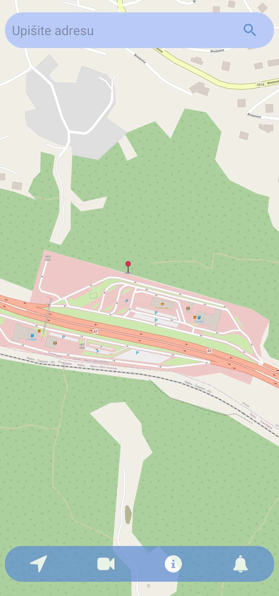
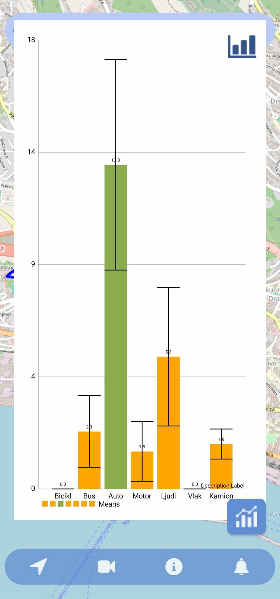
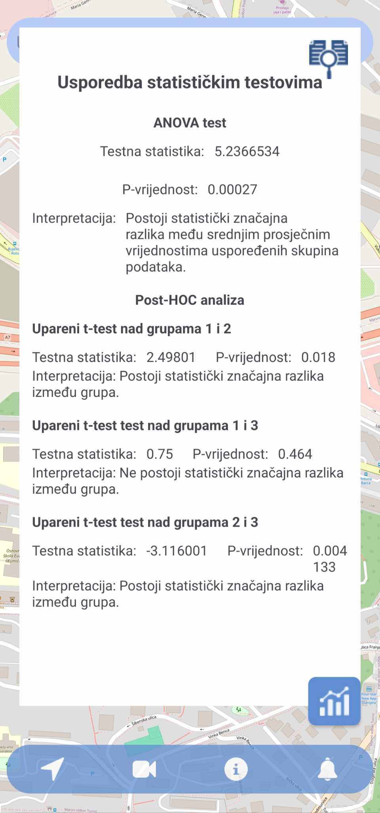
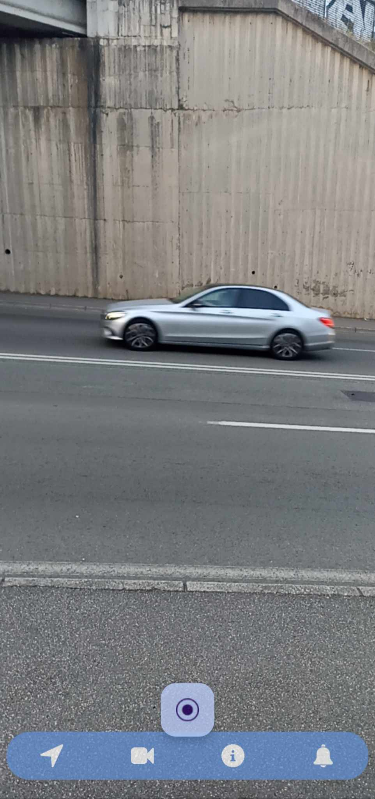
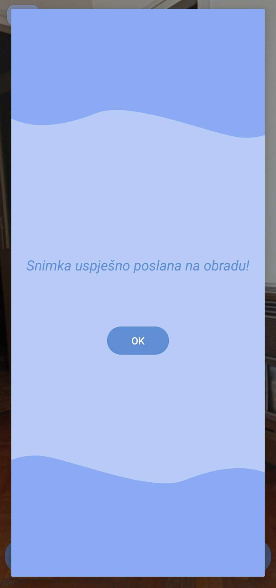
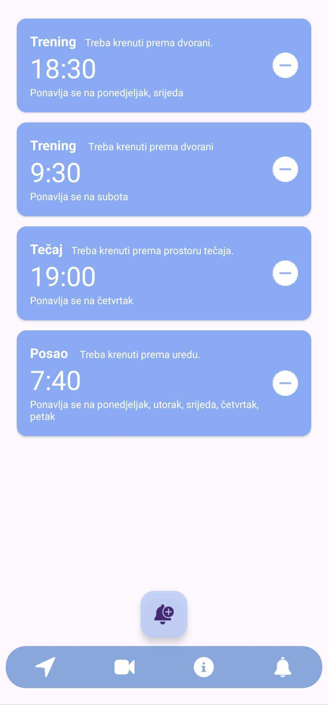
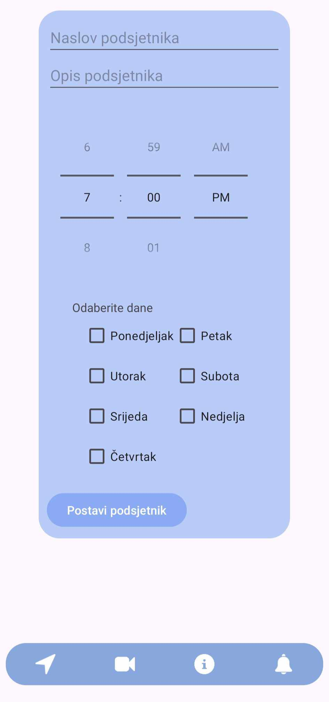

# Funcionalities
### Showing digital map
Digital map view using OpenStreetMap database showing current location of the device, destination location (address from search bar) and routes between them. Can show any saved locations using custom markers.

### Statistical analysis
Visual display of descriptive statistics using graphs (image on the left) and comparison of multiple selected routes using statistical tests (image on the right).

 

### Recording videos for database expansion 
Recording videos for database expansion using CameraX library. Videos are limited both with quality and time (every video is 15 seconds long) so every video has equal amount of frames. Videos are automatically uploaded to Firebase Storage with information needed for classification (geopoint, date, day of the week, time of the day).

 

### Setting reminders
Reminders are created manually (image on the right) by the user and can be deleted. Reminders are shown as push notifications.

 
